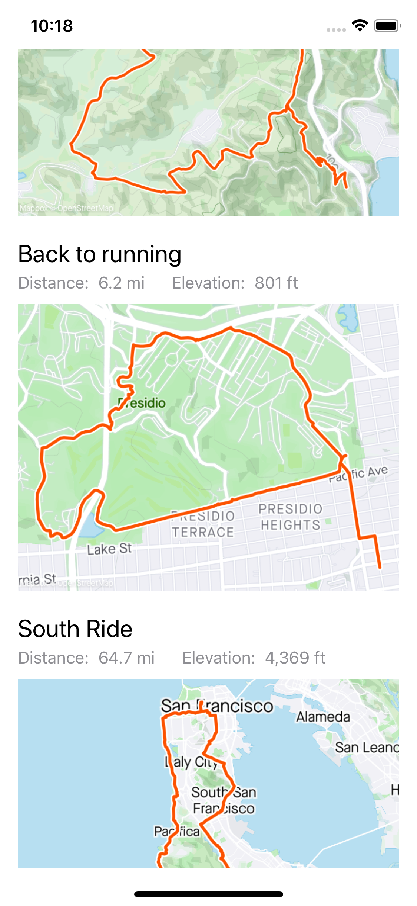

# Strava iOS Technical Take Home Problem

## Summary

Strava allows users to create routes using its mobile application or website. Athletes can then use these routes for navigation while on a run or bike ride.

You will create a new screen to display specific data about all routes in the set for this problem. Help is available to answer any questions you may have.

## Technical Details

The data will come as a JSON payload. It will be an array of objects of the following format:

```json
{
    "id": 2735025266296229722,
    "map_url": "https://d3o5xota0a1fcr.cloudfront.net/maps/RFWF5B76SMZYKXF2KX7POI4EHIA4BSHVBC4ZHHIBWG7HT77NA7YYCZVQUWPR2L7KYX357UJULG3JIARM2U6MDNEENE4BTUNQROHA====",
    "name": "Marin Sunday Run",
    "distance": 14235.319099149601,
    "elevation_gain": 499.08645046007325,
    "type": 2
}
```

The units for `distance` and `elevation_gain` are in meters.

The value of `type` will be one of:

* `1` = `ride`
* `2` = `run`

## Design Details

You can design the screen however you choose as long as all routes are shown and the following information for the route is displayed:

1. Name
2. Distance
3. Elevation
4. Map

> Below is an example of a completed, scrollable screen. Your solution does not have to look like this, but it can if you choose.



<div style="page-break-after: always; break-after: page;"></div>

## Required Tools

* Mac Computer
* Xcode

> _If you do not have access to a Mac, please let the recruiter and/or hiring manager know._

## Provided Code

Some code to help you with this problem is provided in `StravaRoutes/Supporting Files`.

### `routes.json`

A fixture that provides the set of routes and the corresponding data that will be needed for testing. This includes:

  * The unique identifier for the route
  * The map URL
  * The name of the route
  * The distance (in meters).
  * The elevation gain or loss (in meters)

### `RoutesJSONLoader`

Asynchronously loads the above routes fixtures and provides you with a `Data` object to consume however you wish.

### `ImageLoading`

Helper functions to load images from a `URL`.

### `ImperialFormatter`

Helper type to convert metric values from the API response to imperial unit strings for display.
